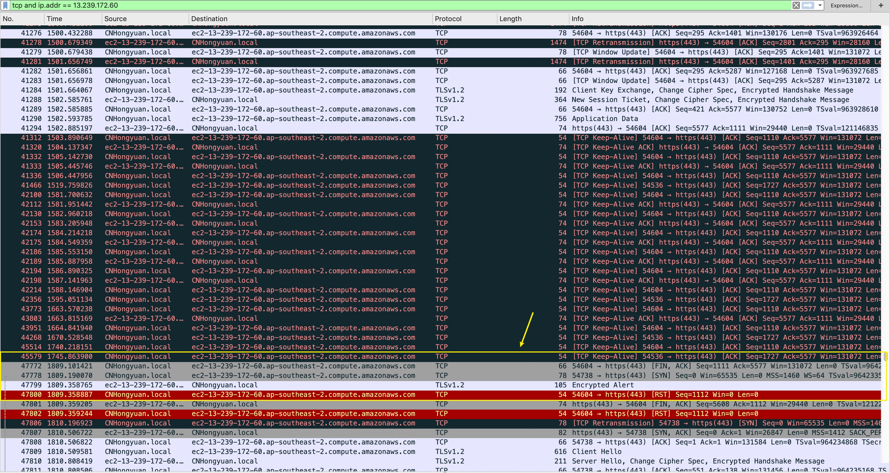

# AWS Lambda Retry

This is the issue reproduce project of unexpected AWS Lambda retry behavior.

## Description

### When

- AWS Lambda function execute for more than 5 minutes (max to 15 minutes)
- Synchronize invoking lambda using `aws-sdk` with option:`InvocationType: 'RequestResponse'`

### Expected Behavior

- AWS Lambda will be invoked **1** time and return lambda response when lambda function exit **immediately**.

### Actual Behavior

- AWS Lambda does not return immediately after the first lambda function exit.
- AWS Lambda will be invoked **3** times (2 retries) and do not return lambda response properly.

## Reproduce Scenario

### AWS Lambda

- AWS Lambda function is a simple Node.js(v10.x) function. It will execute for **5.5** minutes (must >5 minutes). [lambda.js](./lambda.js)
- AWS Lambda function maximum timeout set to **10** minutes.

### Client Side

- Use Node.js version either **v8.11.0** or **v10.15.3**
- Create a `.env` file with your AWS credential. (See [.env.example](./.env.example) for example)
- Run `node --inspect=0.0.0.0 bug.js`. Check [bug.js](./bug.js) for detail.
  > Or run using docker-compose. `docker-compose up --build`

> Note: For Node.js `v8`, the `NODE_DEBUG` env does not support wildcard `*` to enable all logs.
> If you want to test other Node.js versions, be attention to this environment value in [docker-compose.yml](./docker-compose.yml).

### Result

- You will see the lambda retries **2** times.
- And the `error` message in retry callback says `socket hang up`.
- Not get the lambda function response properly.

## Analyze

When using **Wireshark** to capture the TCP traffic. Got the following result:

- Client send `keep-alive` package continually after invoke the lambda function for about 300 seconds.
- Then client send a **[FIN, ACK]** package to lambda server.
- Then client send a **[SYN]** package to lambda server.
- Lambda server response with a **[Encrypted Alert]** back.
- Then **client** will throw a `socket hang up` error and close the connection.

> **Note: No matter we enabled keepAlive or not. After 300 seconds, we will still get `socket hang up` error.**

## Solution

As the analyze showing that it's the client side try to close the connection. So it's not the server side issue for now.

We can guess that there is some mechanism inside **Node.js** or the host **system** itself to send **[FIN, ACK]** package after about 300 seconds long time connection without swapping data.

The cure for this is to send **Heart Beat** package (Anything) periodically (Less than 5 minutes) during the long connection. [solution.js](./solution.js)

After using **Heart Beat** package, the lambda will be only invoked once and client will get response immediately after lambda function returns.
